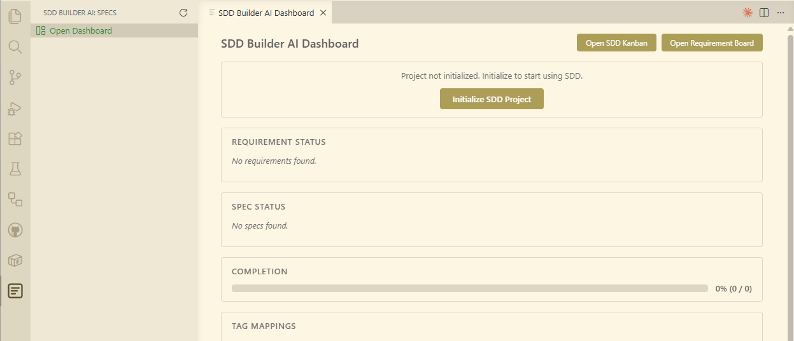
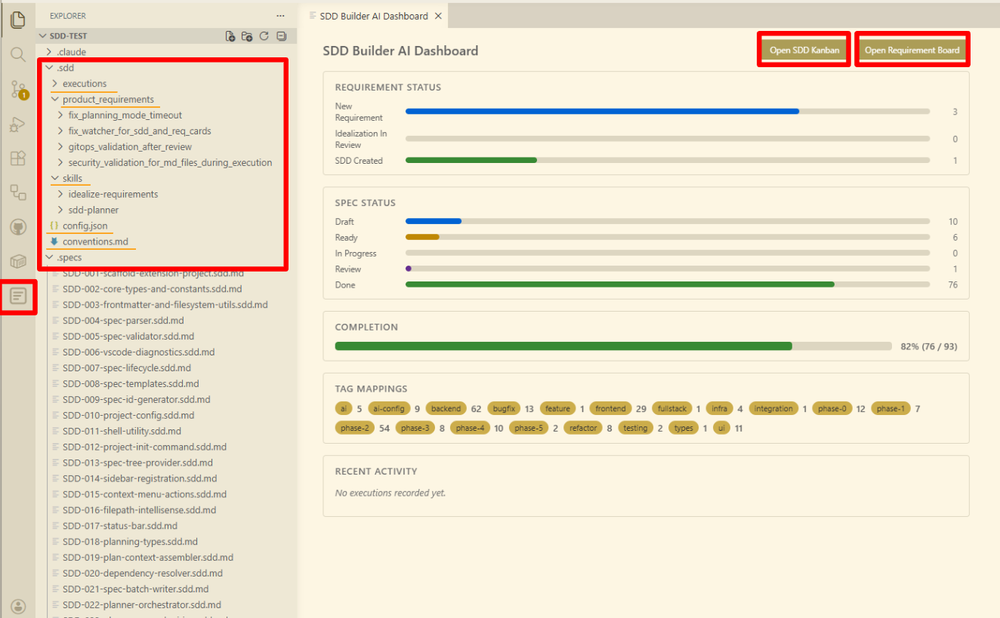
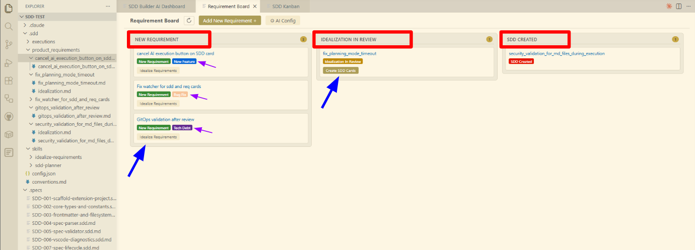
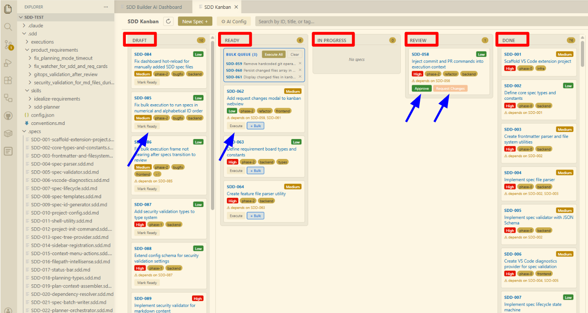
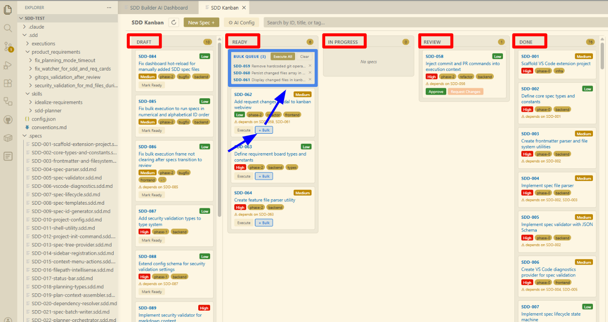
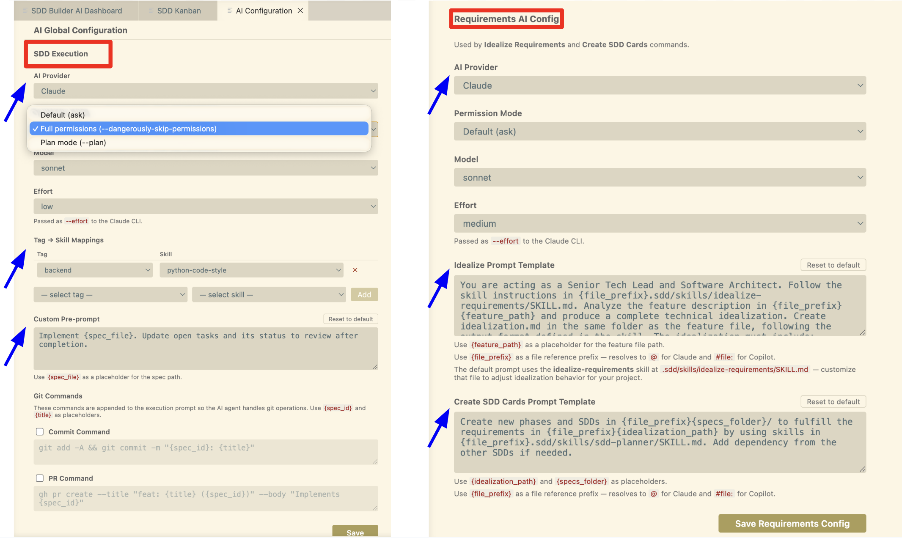

# SDD Builder AI — Govern AI Coding with Spec-Driven Development

**v1.0.0** | **Stop losing control of AI-generated code. Ship with confidence.**

SDD Builder AI is a VS Code extension that brings **Spec-Driven Development** to your AI coding workflow. It sits between your ideas and your AI agent — breaking requirements into small, scoped, reviewable specs that keep every execution focused, traceable, and under your control.

---

## The Problem

Every developer using AI coding tools has hit this wall:

- Ask for one feature → the agent rewrites 15 files
- Large codebase → context overflow → the agent forgets critical code halfway through
- Agent invents APIs, imports, and patterns that don't exist
- Massive diffs you can't reasonably review
- No record of what was asked, what was built, or why

You're not bad at prompting. **The tooling is missing a governance layer.**

---

## The Solution

SDD Builder AI introduces a structured workflow between your ideas and the AI:

```
Feature Ideas → AI Idealizes Requirements → AI Creates Spec Cards → Execute with AI → Review Diff → Ship
```

Every AI execution is governed by a **spec file** — a small contract that tells the agent exactly:

- What to build (and nothing else)
- Which files to read for context (no guessing, no context overflow)
- Which files are off-limits (no accidental rewrites)
- What "done" looks like (acceptance criteria the AI must verify)

The result: **small, focused diffs you can review in minutes, not hours. Reuse and standardize your AI prompt for development**

## Bring Your Own AI (BYOK)

SDD Builder AI does **not** manage API keys or subscriptions. It orchestrates the AI CLI tools you already use:

- **Claude CLI** — Anthropic's command-line agent (`claude`)
- **GitHub Copilot CLI** — GitHub's AI assistant (`gh copilot`)

Install and authenticate with your own account. Your keys, your billing, your model choice — the extension assembles context and delegates execution. It never touches your credentials.

## Key Features

### Project Initialization



Run **SDD: Initialize Project** to scaffold the standard `.sdd/` folder structure:

```
.sdd/
  product_requirements/   # Feature requirements and idealizations
  execution/              # Execution logs and audit records
  skills/                 # Agent skill files (.md) per technology tag
  ai-config.json          # AI provider and execution configuration
  config.json             # Project settings
  conventions.md          # Your coding standards (optional but recommended)
.specs/                   # All .sdd.md spec files
```

---

### Overview dashboard
High-level view of your project's development health at a glance.

- Spec counts by status (Draft, Ready, In Progress, Review, Done)
- Completion percentage across all specs
- SDD tags overview and recent activity feed
- All execution logs saved in `.sdd/execution/` for full audit after development



---

### Requirement Board
Capture raw ideas and turn them into structured development plans with AI.

- Add feature ideas with a name, description, and acceptance criteria
- **AI Idealization** — the AI acts as a software architect, producing a concise requirements document from your idea
- **AI Spec Generation** — one click decomposes the idealization into dependency-ordered SDD spec cards ready for development



---

### SDD Kanban Board
A five-column board where each spec moves from idea to shipped code.

| Status | What happens |
|---|---|
| **Draft** | AI-generated specs land here. Review and refine scope before executing. New specs can also be created manually. |
| **Ready** | Spec is validated and queued for execution. |
| **In Progress** | AI is executing — a terminal opens with real-time output. |
| **Review** | Execution complete. Review the diff and approve or request changes. |
| **Done** | Spec is completed with full audit trail. Commit and PR can be enabled into the prompt in the configuration. |

Drag and drop cards between columns. Every transition is validated — no skipping stages.



---

### Bulk Execution
Select multiple **Ready** specs and execute them sequentially in one action.

- Real-time progress tracking per card — spinner, checkmark, or failure indicator
- Stops automatically on failure so you can review before continuing
- Only available in full-permission AI modes to prevent mid-execution interruptions



---

### Request Changes Flow
When a spec needs rework, your feedback is injected directly into the next execution.

- Review diff in split-view (spec on left, changes on right)
- Approve to mark Done, or write feedback to request changes
- Feedback is appended to the spec's context section and status resets to Ready
- The AI receives your exact feedback in the next run — no context is lost

---

### Scoped Execution — AI That Respects Your Architecture

Each spec enforces hard boundaries:

- **3 files max** to create or edit (excluding tests) — no surprise rewrites
- **`relevant_files`** gives the agent exactly the context it needs — zero context overflow
- **`must_not_touch`** protects sensitive files — auth, config, database schemas stay safe
- **`conventions.md`** injects your project's coding standards into every execution
- **Skills per spec tag** — tag specs with `python`, `react`, `database`, etc., and configure skill files that are injected into the execution prompt automatically

---

### AI Configuration
Separate configuration for requirements AI and execution AI.

- Choose your AI provider: **Claude CLI** or **GitHub Copilot CLI**
- Set permission modes per provider
  - Full permission: a terminal is created and the AI CLI executes all commands. The watch sentinel monitors when the AI finishes and update the SDD card for review.
  - Plan mode: a terminal opens and the AI CLI executes in plan mode. The user should press the complete button to move it to review phase. 
- Tag-to-skill mappings with custom skill files. The skills are injected into the prompt when a spec with the corresponding tag is executed, giving you precise control over the agent's capabilities per task.
- Prompt templates for idealization, spec generation, and execution phases — customize the instructions and context you give the AI at each step.
- Configurable `git commit` and `git pull-request` commands into the prompt context.



---

## Why Specs Beat Prompts

| | Freeform Prompting | Spec-Driven Development |
|---|---|---|
| **Scope** | Unbounded — AI decides what to touch | Explicit — 3 files max, list of relevant files |
| **Context** | Entire codebase or none | Precisely scoped — only what the agent needs |
| **Review** | Massive, unstructured diff | Small, focused diff with acceptance criteria |
| **Progress** | Not measurable | Tracked per spec — percentages, counts |
| **Reproducibility** | Same prompt, different results | Same spec, consistent execution |
| **Traceability** | Lost in chat history | Version-controlled in Git with full audit trail |
| **Feedback** | Start over from scratch | Feedback injected directly into the next run |

---

## Requirements

- **VS Code** 1.85 or later
- **AI CLI (BYOK)** — one of the following, installed and authenticated:
  - [Claude CLI](https://docs.anthropic.com/en/docs/claude-code) (`npm install -g @anthropic-ai/claude-code`)
  - [GitHub Copilot CLI](https://docs.github.com/en/copilot/github-copilot-in-the-cli) (`gh extension install github/gh-copilot`)
- **Git** configured in the workspace
- **gh CLI** (optional, for PR automation) — [cli.github.com](https://cli.github.com)

---

## Getting Started

1. Install the extension from the VS Code Marketplace
2. Open a project folder in VS Code
3. Open the Command Palette (`Ctrl+Shift+P` / `Cmd+Shift+P`) and run **SDD: Initialize Project**
4. Click the SDD icon in the Activity Bar to open the sidebar
5. Click **Open Dashboard** to see the SDD Builder AI dashboard
6. Go to the **Requirement Board** and add your first feature idea
7. Click **Idealize** to let the AI structure your requirement
8. Click **Create SDD Cards** to generate spec files
9. Open the **Kanban Board**, move a spec to Ready, and execute

---

## Tech Stack

| Layer | Technology |
|---|---|
| Extension | TypeScript |
| Webview UI | Svelte 5 + Vite |
| Spec format | YAML frontmatter + Markdown |
| AI execution | Claude CLI / GitHub Copilot CLI |
| Version control | Git CLI + gh CLI |

---

## Feedback & Issues

Report bugs and feature requests at [GitHub Issues](https://github.com/andrelmm91/sdd-agentic/issues).

---

**SDD Builder AI** — Structure your AI. Ship with confidence.
